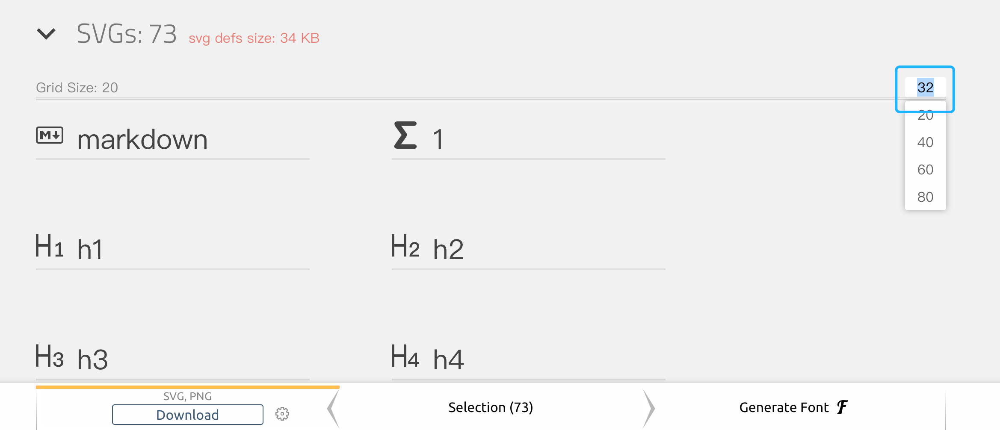

## 安装

1. 获取图标并解压
2. 在思源中依次点击 设置 -> 外观 -> 图标 -> 打开图标文件夹
3. 将图标拷贝到该文件夹中
4. 重启思源后在 设置 -> 外观 -> 图标 中选择安装好的图标

## 开发

### 步骤

1. 为你的图标取一个好听的名字，如 `alice`
2. 在思源中依次点击 设置 -> 外观 -> 图标 -> 打开图标文件夹
3. 在打开的文件夹中新建文件夹 `alice`，在 `alice` 中新建 `icon.js` 和 `icon.json` 文件 `icon.json` 文件如下：

   ```json
   {
     "author": "Vanessa",
     "url": "https://github.com/Vanessa219"
     "version": "1.0.0"
   }
   ```
4. 打开 `icon.js` 文件，贴入制作完成的图标
5. 重启思源后在 设置 -> 外观 -> 图标 中选择安装好的图标

### 图标的制作

* 使用浏览器打开图标文件夹中的 `index.html` 文件
* 根据图标名称和形状制作相似的图标

  * 前往 [Iconfont](https://www.iconfont.cn) 搜索中意的图标，下载 SVG 格式
  * 使用矢量图工具自行制作 SVG 格式的图标
  * 前往 [pngtosvg](https://www.pngtosvg.com/) 将图片转换为 SVG 格式
* 前往 [IcoMoon App](https://icomoon.io/app/#/select) 制作 `icon.js`

  * 点击右上角的 `Import Icons` 导入上一步制作好的图片
  * 选中图标并生成 SVG
  * 修改大小并下载
  * 修改 `<symbol id="icon-markdown" viewBox="0 0 32 32">` 中的 `id` 为 `index.html` 对应的图标名
  * 将 `<defs>...</defs>` 中的内容替换到 `icon.js` 中对应的位置
* 测试

  * 将 `index.html` 中 `material` 替换为 `alice`

    ```html
    <script src="material/icon.js"></script>
    ```
  * 刷新 `index.html` 查看最终效果
  * 打开思源在 设置 -> 外观 -> 图标 中选择开发完成的图标进行查看
* 上架发布（联系 QQ：84588990）
